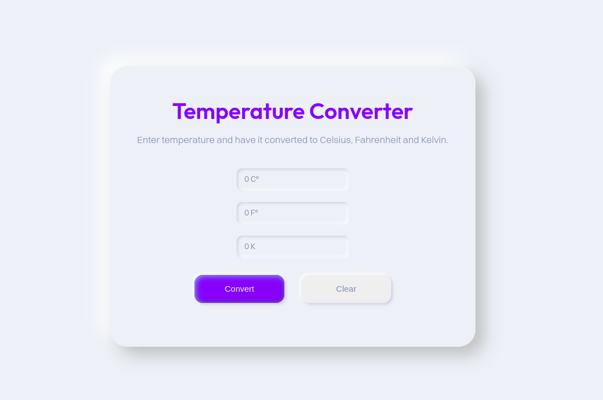

# 🌡️ Temperature Converter

This is a temperature converter that converts to **Celsius**, **Fahrenheit** and **Kelvin**.

# Techs

This project was developed with:
* HTML
* CSS
* JavaScript

# The project

The project it's useful for when the user wants to convert a temperature to another. It's simple, you don't need to select anything, just enter with the temperature in one of the inputs and click convert and the user will have it converted in all of them. There's also a "Clear button" to clear the page, so the user doesn't need to refresh the page to use the converter again. 
The layout was created with inspiration from the Neumorphism, which gives it a modern and cool aesthetic.

## Visit the project

You can check it out the [**project**](https://github.com/samhari07/Bharat_Intern_Task1) here.

---
Created with 💜 by [**HARIGANESH M**](https://github.com/samhari07) 
